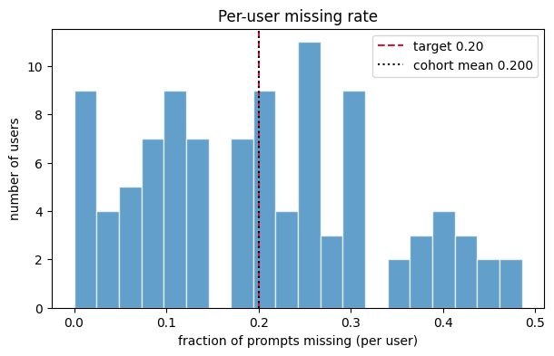
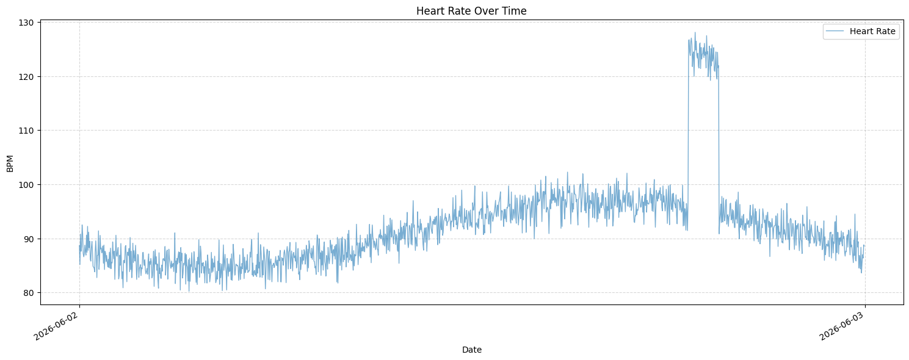
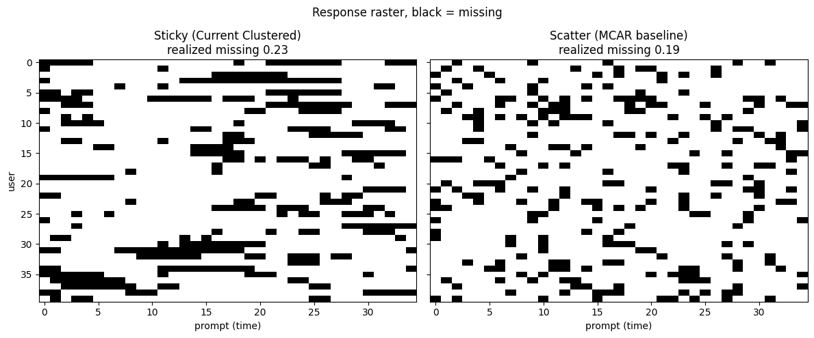

# syntheticData

*Tyler Le*

*Date: 06/02/2026*

[GITHUB](<https://github.com/tylerrleee/HealthyGatorSportFan/tree/mssd-tyler>)

This directory serves two purposes:

1. **Production-aligned cohort generation** — `react_cohort.py` (canonical) emits synthetic DataFrames that match the deployed schema (`analysis-resources/production_schema.md`) and the Labfront / Garmin Venu 3 wearable source, so offline analysis code (`analytics/scripts.py`, `analytics/example_analysis.ipynb`) can run without a live database.
2. **MSSD construct validation** — `synthetic_generator.py` (legacy) generates EMA/HR signals with known latent volatility to validate MSSD (Mean of Squared Successive Differences) as a measure of temporal instability.

# Scope

The wearable data source is **Labfront (Garmin Venu 3)** — not Fitabase or Fitbit. Simulation focuses on EMA (qualitative) and heart-rate / stress (quantitative) signals; other Garmin streams (steps, sleep, etc.) are omitted for simplicity.

## Files

### `react_cohort.py`

**Canonical, production-aligned generator.** `generate_react_cohort(...)` returns synthetic DataFrames keyed to the deployed `app_*` tables (users, ema, ema_item_responses, jitai, heart_rate, stress_samples, engagement, wearable_devices), matching `analysis-resources/production_schema.md`. EMA Likert values are **1–7** (matching `MinValueValidator(1)`/`MaxValueValidator(7)` in `backend/app/models.py`); the wearable `source` is `garmin_labfront` and device ids are `labfront_participant_id`. `patch_scripts_loaders()` monkeypatches the `analytics/scripts.py` loaders to serve these frames, so the analysis notebook runs with no database. It reuses `_clustered_missing_mask` from `synthetic_generator.py`.

### `main.py`

Generates a cohort of 100 synthetic users over 7 days, producing both EMA and heart rate DataFrames (DF). Runs all diagnostic plots and saves them to `figures/`.

In scope: Parameters can be tweaked to simulate different cohorts, producing a distinct DF. 

Out of scope: DF does not save. 

### `synthetic_generator.py` (legacy)

Legacy MSSD construct-validation harness (superseded by `react_cohort.py` for analysis cohorts). Uses a **1–5** Likert scale and a flat dataframe shape that does **not** match the production schema; retained because `react_cohort.py` imports `_clustered_missing_mask` from it. Contains two generators:

- **EMA Generator** — Produces per-user EMA time series with known latent volatility using an AR(1) process (see below about why AR(1)). 
    - Each user gets randomly drawn parameters (`mu`, `sigma`, `rho`) that serve as ground truth for validating MSSD. EMA values are mapped to a 1-5 Likert scale (for now). Missingness or no response is injected via randomness (`_clustered_missing_mask`) that produces realistic clustered gaps rather than random dropout.
    - No response are clustered, instead of purely random. Although this missingness can be controlled, it helps simualate the prolonged responsiveness of certain individuals
        - e.g. phone is on DND, has an exam, watching the Knicks winning NBA Finals, etc,..
    
  - `generate_user_ids()` - Creates unique UUIDs for each user.
  - `generate_user()` - Generates one user's EMA series with known latent parameters.
  - `generate_cohort()` - Generates the full cohort DataFrame.

- **Heart Rate Generator** — Produces minute-level HR data per user, random Gaussian noise, and activity bouts (exercise spikes). Resting HR is estimated from [60,100] for young adults. 
  - `_generate_heart_rate()` — Generates one user's minute-level HR series.
  - `generate_HR()` — Generates HR data for the full cohort.
    - Parameters are tweakable in `synthetic_generator.py`

#### First-Order Autoregressive Model

*['Autoregressions', Economics-With-R](<https://www.econometrics-with-r.org/14.3-autoregressions.html>)*

An autoregressive model relates a time series variable to its past values.

In our case, the goal is to 'model' a person's fluctuating psychological state, which is **dependent on the previous state**.

Formula:

$$
z_t = \rho * z_{t-1} + e_t
$$

$z_t$: User's state

$z_{t-1}$: User's state at the previous time step

$e_t$ : Random noise that influence user's state (e.g. FSU just scored, just took some cognac, hitting a PR)

e_t ~ $Normal(0, \sigma_{e^2})$ : random noise is Normally distributed.
  - On average, most noise are close to the mean, 0, but sometimes, depending $\sigma_{e^2}$, it can be influential

### `plotting.py`

Diagnostic visualizations for validating the synthetic data. All figures are saved to `figures/`.

- `plot_gap_histogram()` — Distribution of missing-run lengths vs. the expected geometric distribution.
- `plot_missing_rate_histogram()` — Per-user missing rate distribution compared to the target response rate.
- `plot_response_raster()` — Side-by-side raster comparing clustered (sticky) missingness against an MCAR baseline.
- `plot_heart_rate()` — Heart rate over time for a single user.

### `notebook/Tien_Le_MSSD_v1_0.ipynb`

Research notebook documenting the MSSD methodology

### `figures/`

Output directory for saved plots:

- `gap_histogram.png` - Missing-run length distribution.

- `missing_rate_histogram.png` - Per-user missing rate histogram.

- `heart_rate_analysis.png` - Sample heart rate time series.

- `response_raster.png` - Sticky vs. scatter missingness raster.

---

## MSSD construct-validity methodology (legacy harness)

The legacy `synthetic_generator.py` exists to prove that the First-Order Autoregressive $AR(1)$ process is a reliable ground truth for Mean of Squared Successive Differences (MSSD) validation.

* **The Goal:** Verify that a higher preset latent volatility ($\sigma_{e^2}$ or lower $\rho$) in the EMA generator mathematically maps to a higher calculated MSSD from the generated 1–5 Likert scale output.
* **The Test Harness:** * Generate a test cohort where sub-groups are assigned distinct, known parameters (e.g., Stable vs. Volatile cohorts).
* Calculate empirical MSSD on the generated time series using:

$$MSSD = \frac{1}{N-1} \sum_{t=1}^{N-1} (z_{t+1} - z_t)^2$$

* **Success Metric:** Plot Ground Truth Variance vs. Empirical MSSD. A strong, positive linear correlation validates the construct as an effective benchmark despite missingness masks.

---

## Status & known limitations

**Done (in `react_cohort.py`):**

* Wearable profile is **Garmin Venu 3 via Labfront** — `source = "garmin_labfront"`, device id `labfront_participant_id`. No Fitabase or Fitbit.
* EMA Likert scale is **1–7**, matching the production model validators.
* Output frames match `analysis-resources/production_schema.md` and feed `analytics/scripts.py` via `patch_scripts_loaders()`.

**Known limitations / not implemented:**

* `react_cohort.py` does **not** generate `phone_telemetry`, `checkin_reminder`, or `event_day` (not consumed by the current analysis pipeline).
* No **HRV / RMSSD** generation — there is no HRV column in the production schema (`StressSample` carries only a 0–100 `stress_score`; `HeartRateSample` only `bpm`).
* There is **no automated DB seeder** — the generators return in-memory DataFrames for offline analysis, not a database-push routine.
